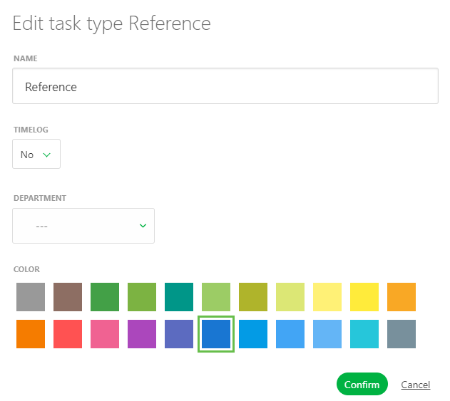
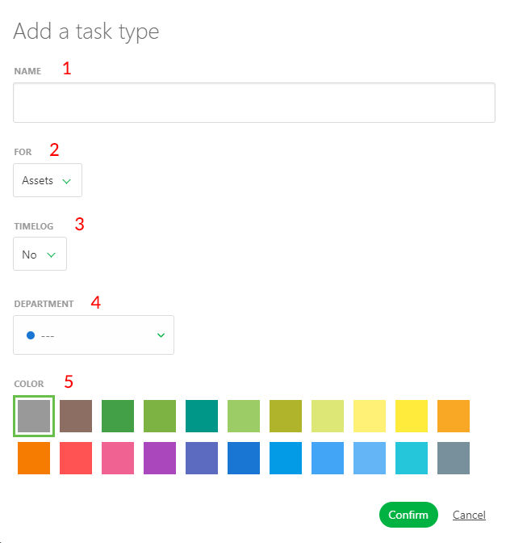
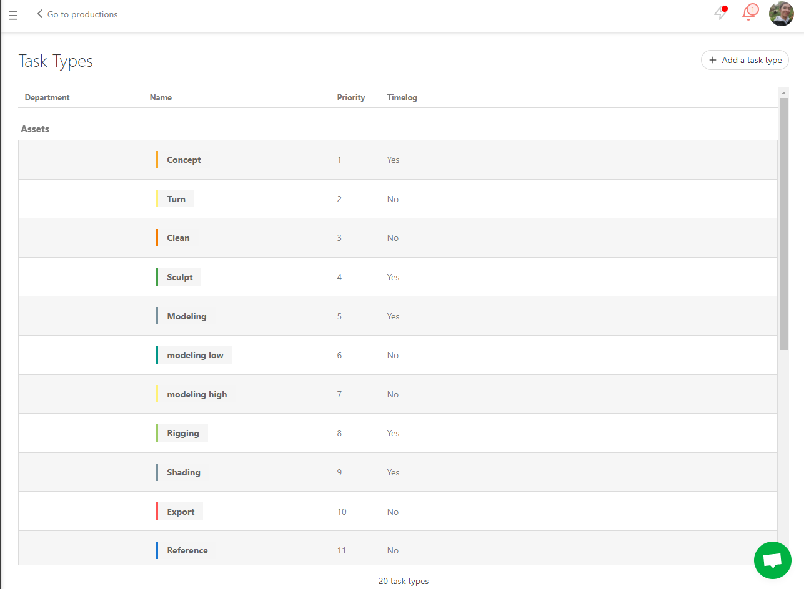
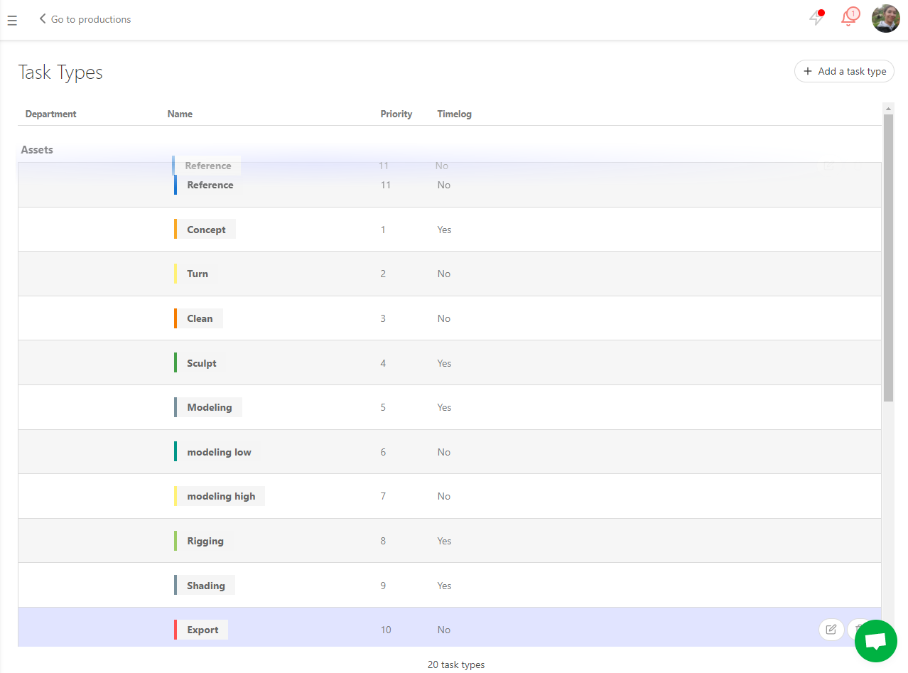
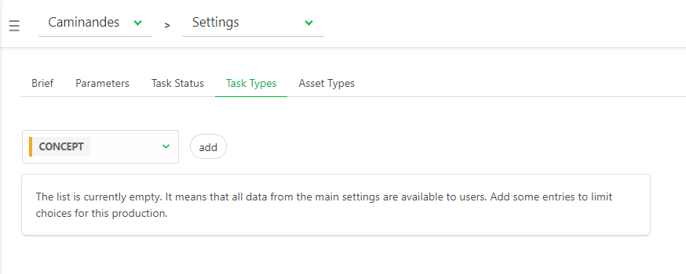
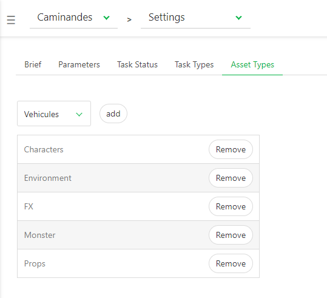

# Customization of the workflow

## Modify an existing Task Type

On the main menu  select the 
**TASK TYPES** page under the **Admin** section.

On the main page, you can edit all the tasks already created 
.

You can change : 

the order of the tasks by drag and move them to the wanted position.

- (1) The name of the task type
- (2) If the artists need to time log their work on this task type
- (3) To which departement is it linked
- (4) The color 

Click on **Confirm** to save your changes.

**SEE Department page**

## Create a new Task Type

On the main menu  select 
the **TASK TYPES** page under the **Admin** section.

On the main page, click on the 
button.

On the new pop up you can define your personalized task:

- (1) The name of the task type
- (2) For which entity it is used
- (3) If the artists need to time log their work for tasks with this task type
- (4) To which departement is it linked
- (5) The color 

Click on **Confirm** to save your changes.

Per default the new task type will be at the bottom of the list. To change the order, grab the task type and move it a his right place.

## Modify an existing Task Status

On the main menu  select the 
**TASK STATUS** page under the **Admin** section.

On the main page, you can edit some status already created 
. Except 

and , which are parts of the core
system.

 
You can change : 
- (1) The name of the status
- (2) His short name, useful for the filters
- (3) If this status is used to validate a task (useful for the quota, to clean tthe todo list, and episode stat page)
- (4) If this status is used to give comment a task (useful to keep track of the back and forth in the task type page, and for the episode stats page)
- (5) Can the artist use this status. If **No** the artist won't see this status on his list. But he can post on top of it.
- (6) Can the client use this status. If **No** the client won't see this status on his list
- (7) Choose a color you like

Click on **Confirm** to save your changes.

## Create a new Task Status

On the main menu  select the 
**TASK STATUS** page under the **Admin** section.

On the main page, click on the  button.

On the new pop up you can define your personalized task : 

- (1) The name of the status
- (2) His short name, useful for the filters
- (3) If this status is used to validate a task (useful for the quota, to clean tthe todo list, and episode stat page)
- (4) If this status is used to give comment a task (useful to keep track of the back and forth in the task type page, and for the episode stats page)
- (5) Can the artist use this status. If **No** the artist won't see this status on his list. But he can post on top of it.
- (6) Can the client use this status. If **No** the client won't see this status on his list
- (7) Choose a color you like

Click on **Confirm** to save your changes.

## Define specific workflow per production

### Select speticific Task Status for a production

On the **Action Menu**, choose on the drop down menu the "Setting" 

Per default, Kitsu will load all the Task Status of your status library into your production.

But you can choose to use only specific status.

On the "Task Status" tab, you can choose which status you want to use on this production, 
validate your choice with the "add" button.

### Select specific Task Types for a production

On the **Action Menu**, choose on the drop down menu the "Setting" 

Per default, Kitsu will load all the Task Types of your status library into your production.

But you can choose to use only specific Task Types, depending of the type of your production.

For example you can create a 2D and A CGI workflow on your library, and add the needed task types into this production.

On the "Task Types" tab, you can choose which status you want to use on this production, 
validate your choice with the "add" button.

### Select specific Asset Types for a production

On the **Action Menu**, choose on the drop down menu the "Setting" 

Per default, Kitsu will load all the Asset Types of your status library into your production.

But you can choose to use only specific Asset Types, depending of the type of your production.

On the "Asset Types" tab, you can choose which Asset Types you want to use on this production, 
validate your choice with the "add" button.

Or you can use the main menu

To navigate through Kitsu sections, you need to use the sidebar. You can 
access it through the three lines button on top of the screen 
.  It opens a menu on
the left part of the screen. We want to see the production list. 
So below **Studio** section, click on the **PRODUCTIONS** button. 

There, you can see all the productions you have created, their type, and their status (open
for an Active Production, or Closed if not Active). When your cursor is above a
production line, you can see two news icons on the right part of the line :
**edit**  and **delete**
.

To modify a production, go into the **Edit production** page. 

You can add some specific information as the **FPS** (Frames per second), 
the **Ratio** and the **Resolution** of the picture.

If nothing is filled, the **FPS** is set to **24 FPS** per default. 
The **FPS** will be applied to re-encode the video and also to calculate the quotas.

NB: The default avatar for a production is the first letter displayed on a
colored background. You can change it with a picture if you want.

