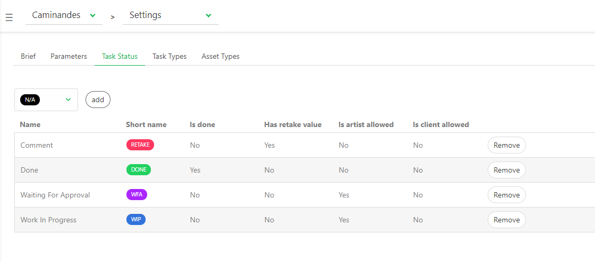
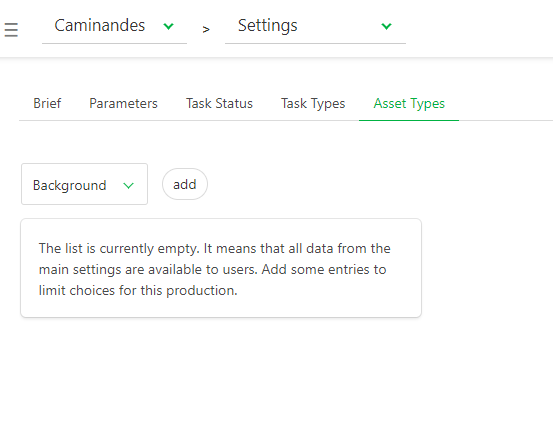

# Customization of the workflow

## Modify an existing Task Type

On the main menu  select the 
**TASK TYPES** page under the **Admin** section.

On the main page, you can edit all the tasks already created 
.

You can change : 

the order of the tasks by drag and move them to the wanted position.

- (1) The name of the task type
- (2) If the artists need to time log their work on this task type
- (3) The color 

Click on **Confirm** to save your changes.

## Create a new Task Type

On the main menu  select 
the **TASK TYPES** page under the **Admin** section.

On the main page, click on the 
button.

On the new pop up you can define your personalized task:

- (1) The name of the task type
- (2) The priority, meaning the order of the task type columns
- (3) For which entity it is used
- (4) If the artists need to time log their work for tasks with this task type
- (5) The color 

Click on **Confirm** to save your changes.

## Modify an existing Task Status

On the main menu  select the 
**TASK STATUS** page under the **Admin** section.

On the main page, you can edit some status already created 
. Except 

and , which are parts of the core
system.

 
You can change : 
- (1) The name of the status
- (2) His short name, useful for the filters
- (3) If it's the end of the task
- (4) If it will count as a retake (for the supervisor page)
- (5) If the artist / Vendor can use this status
- (6) If the Client can use this status
- (7) The color 

Click on **Confirm** to save your changes.

## Create a new Task Status

On the main menu  select the 
**TASK STATUS** page under the **Admin** section.

On the main page, click on the  button.

On the new pop up you can define your personalized task : 

- (1) The name of the status
- (2) His short name, useful for the filters
- (3) If you can upload a preview with this task
- (4) If it's the end of the task
- (5) The color 

Click on **Confirm** to save your changes.

## Define specific workflow per production

### Select speticific Task Status for a production

On the **Action Menu**, choose on the drop down menu the "Setting" 

Per default, Kitsu will load all the Task Status of your status library into your production.

But you can choose to use only specific status.

On the "Task Status" tab, you can choose which status you want to use on this production, 
validate your choice with the "add" button.

### Select specific Task Types for a production

On the **Action Menu**, choose on the drop down menu the "Setting" 

Per default, Kitsu will load all the Task Types of your status library into your production.

But you can choose to use only specific Task Types, depending of the type of your production.

For example you can create a 2D and A CGI workflow on your library, and add the needed task types into this production.

On the "Task Types" tab, you can choose which status you want to use on this production, 
validate your choice with the "add" button.

### Select specific Asset Types for a production

On the **Action Menu**, choose on the drop down menu the "Setting" 

Per default, Kitsu will load all the Asset Types of your status library into your production.

But you can choose to use only specific Asset Types, depending of the type of your production.

On the "Asset Types" tab, you can choose which Asset Types you want to use on this production, 
validate your choice with the "add" button.

