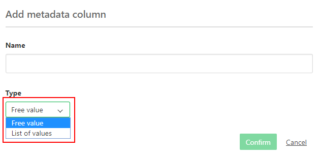
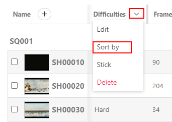
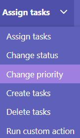
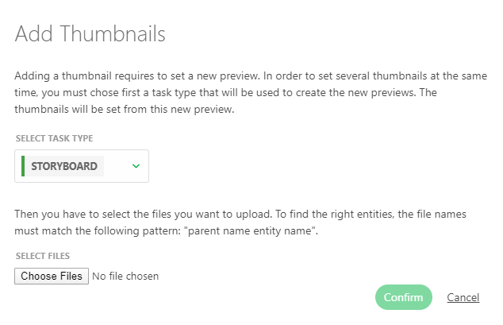
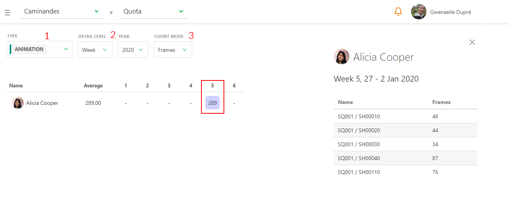

# Getting started as a Production Manager - Advanced Users

## Create assets from a csv spreadsheet file

You may have already your asset list ready in a spreadsheet file.
With Kitsu you have 2 ways to import them, the first is to import a `.csv` file directly, the second is to copy paste your data directly into Kitsu.

First save your spreadsheet as a `.csv` file.

Then, go back to the asset page on Kitsu, and click on the **Import** icon.

A pop-up window **Import data from a CSV** opens, click on **Browse** to pick your `.csv` file.

To see the result, click on the **Preview** button.
  
You can check and adjust the name of the columns with the preview of your data.
 
NB: the **Episode** column is only mandatory for a **TV Show** production.
 

Once everything is good, click on the **Confirm** button, to import your data into Kitsu.

Now, you have all your assets imported into Kitsu.

## Create assets with copy/paste a spreadsheet file

Open you spreadsheet, select your data and copy them.

Then, go back to the asset page on Kitsu, and click on the **Import** icon 
.

A pop-up window **Import data from a CSV** opens, click on the **Paste a CSV data** tab.

 
There you can paste your previously selected data, and see the result with the **Preview** button.
 

  
You can check and adjust the name of the columns with the preview of your data.
 
NB: the **Episode** column is only mandatory for a **TV Show** production.
 

Once everything is good, click on the **Confirm** button, to import your data into Kitsu.

Now, you have all your assets imported into Kitsu.

## Update assets with the CSV import

You can use the CSV import to update quickly your data.

You need to switch on the option **Update existing data**. Then the lines that will be updated
will be highlighted in blue.

## Update assets with copy/paste a spreadsheet file

Open you spreadsheet, select your data and copy them.

Then, go back to the asset page on Kitsu, and click on the **Import** icon 
.

A pop-up window **Import data from a CSV** opens, click on the **Paste a CSV data** tab.

 
There you can paste your previously selected data, and see the result with the **Preview** button.
 

  
You can check and adjust the name of the columns with the preview of your data.

NB: the **Episode** column is only mandatory for a **TV Show** production. 
 
You need to switch on the option **Update existing data**. Then the lines that will be updated
will be highlighted in blue.

Now, you have all your assets imported into Kitsu.

## Create shots from a csv spreadsheet file

You may have already your shots list ready in a spreadsheet file.
With Kitsu you have 2 ways to import them, the first is to import a `.csv` file directly, the second is to copy paste your data directly into Kitsu.

First save your spreadsheet as a `.csv` file.

Then, go back to the shot page on Kitsu, and click on the **Import** icon.

A pop-up window **Import data from a CSV** opens, click on **Browse** to pick your `.csv` file.

To see the result, click on the **Preview** button.
  
You can check and adjust the name of the columns with the preview of your data.
 
NB: the **Episode** column is only mandatory for a **TV Show** production.
 

Once everything is good, click on the **Confirm** button, to import your data into Kitsu.

Now, you have all your shots imported into Kitsu.

## Create shots with copy/paste a spreadsheet file

Open you spreadsheet, select your data and copy them.

Then, go back to the shot page on Kitsu, and click on the **Import** icon 
.

A pop-up window **Import data from a CSV** opens, click on the **Paste a CSV data** tab.

 
There you can paste your previously selected data, and see the result with the **Preview** button.
 

  
You can check and adjust the name of the columns with the preview of your data.
 
NB: the **Episode** column is only mandatory for a **TV Show** production.
 

Once everything is good, click on the **Confirm** button, to import your data into Kitsu.

Now, you have all your shots imported into Kitsu.

## Update Shots information with CSV Import

You can use the **CSV Import** to update your data as the **NB Frames**, **Frame IN**, **Frame Out** or any **Custom Column**

Open you spreadsheet, select your data and copy them.

Then, go back to the shot page on Kitsu, and click on the **Import** icon 
.

A pop-up window **Import data from a CSV** opens, click on the **Paste a CSV data** tab.

 
There you can paste your previously selected data, and see the result with the **Preview** button.
 

  
You need to switch on the **Option : Update existing data**.
the updated shots will be in blue

 
NB: the **Episode** column is only mandatory for a **TV Show** production.
 

Once everything is good, click on the **Confirm** button, to import your data into Kitsu.

Now, you have all your shots imported into Kitsu.

## Add Custom columns

To add more information on the general spreadsheet pages, you have to create a 
**Custom column**.

Click on the **+** near the Name column.

You may have extra information to add on your pages as the **level of difficulties**,
the **name of the studios**, when a production is split, the shot order, etc.

In the custom column, you can store all kinds of text information: a **list of value** or a **free value**.

The **free value** is different for each entity.

The **list of value** gives you the same choice for each entity. Moreover, it has to be filled now. 

Type the elements of the list below **Available values**, and confirm them by clicking on **Add value**.

Validate the creation of the custom column with the **Confirm** button.

Back on the global spreadsheets page, you can fill this information with the edit 
button .

You now see a new line on the edit pop-up. You can select the information from the list, 
alternatively, enter the free values, depending on your previous choice.

Don't forget to press the **Confirm** button when you are done.

If you need to **edit** or **delete** the custom column, go back to the general spreadsheet page.
Nearby the name of your custom column, click on the arrow . 

You can now **sort** your global page with this new column. For example let's create a **Sort Order** custom column.

then click on the arrox on the right of the column name to open his menu.Then click on **Sort By**

Now the shots are not sorted by name but by the custom column information.

You can also select in the menu if you want to edit the name of the custom column and its information, or if you want to delete it.

You can also use the **CSV Import** to fill quickly your custom column.
You need to first create your **Custom Column** into kitsu, then add it in your spreadhseet, then copy paste your data into the **CSV Import**.
[Update Shots information with CSV Import](#update-shots-information-with-csv-import)

## Add multiple Preview

You can add multiple images at the same time, or, once you have uploaded an image, you can add another one.

The **Add preview** pop-up opens and asks you to choose a file.

You can navigate through the pictures uploaded. You need to enlarge the comment section. 

And then click on the number of the picture to see them all.

You can change the order of the preview by drag and drop them.

To delete an additional preview, you need to enlarge the comment panel.

And then click on the 

## Create a breakdown list from a CSV file

You may have already your breakdown list ready in a spreadsheet file. With Kitsu you have 2 ways to import it, the first is to import a .`csv` file directly, the second is to copy paste your data directly into Kitsu.

First save your spreadsheet as a `.csv` file following Kitsu's recommandation.

Click on the **import** button 

A pop-up window **Import data from a CSV** opens, click on **Browse** to pick your `.csv` file.

To see the result, click on the **Preview** button.

You can check and adjust the name of the columns with the preview of your data.

NB: the **Episode** column is only mandatory for a **TV Show** production.

Once everything is good, click on the **Confirm** button, to import your data into Kitsu.

Now, you have your breakdown imported into Kitsu.

## Create a breakdown list with copy/paste a spreadsheet file

Open you spreadsheet, select your data and copy them.

Then, go back to the breakdown page on Kitsu, and click on the **Import** icon 
.

A pop-up window **Import data from a CSV** opens, click on the **Paste a CSV data** tab.

 
There you can paste your previously selected data, and see the result with the **Preview** button.
 

  
You can check and adjust the name of the columns with the preview of your data.
 
NB: the **Episode** column is only mandatory for a **TV Show** production.
 

Once everything is good, click on the **Confirm** button, to import your data into Kitsu.

Now, you have all your assets imported into Kitsu.

## Add employees from a csv spreadsheet file

You may have already your employee list ready in a spreadsheet file.
With Kitsu you have 2 ways to import them, the first is to import a `.csv` file directly, the second is to copy paste your data directly into Kitsu.

First save your spreadsheet as a `.csv` file.

Then, go back to the people page on Kitsu, and click on the **Import** icon.

A pop-up window **Import data from a CSV** opens, click on **Browse** to pick your `.csv` file.

To see the result, click on the **Preview** button.
  
You can check and adjust the name of the columns with the preview of your data.

NB: the **Role** column is not mandatory.
 

Once everything is good, click on the **Confirm** button, to import your data into Kitsu.

Now, you have all your people imported into Kitsu.

## See detail of a shot

If you want to see a detail of a shot, click on its name. 

A new page opens with the list of the tasks, the assignation, and the list
of assets that appear on this shot (**Shot casting**).
 

 
You can click on the status of each task to open the comment panel and see the history of the comments and the different versions.

## Change priorities

At some point on the production you may want to prioritize some tasks, and
pinpoint these urgent tasks to your team.

For this, we use the same technique as before. Click on the space
near a status task (1). 

The action menu appears on the top of the screen. 

Click on the name on the left on the action menu, and choose 
**Change priority**.

There are four levels of priority: **Normal**, that is the fundamental level of all the
tasks, **High**, **Very High**, or **Emergency**. Save the changes with the
**Confirm** button.

As we have done for the assignation or the status, select the shots (1), select
the level of priority (2), and apply with **Confirm** (3).

You can now see next to the status of the task some **exclamation marks**. The
more there are, the more urgent the task is.  

* (1) is **Normal**, 
* (2) is **High**,
* (3) is **Very High**
* (4) is for **Emergency**.
    

## Add batch of thumbnails (and previews)

You can use the **Add Thumbnails** button  on the global page to massively import thumbnails.

A new pop-up opens and asks you to choose which task types the thumbnails are linked.

**Thumbnails batch import accept images files and video files**.

For the video files, only the first frame is used as the thumbnail.

You have to name your thumbnails as sequence_shot.

## Change status per batch

Alternatively, you can do it per **batch**. 

You can select multiple shots or assets, by pressing the **crtl** or
**shift** key.

Then go to the **Change status** section on the action menu.

Choose the new status for your selected tasks (1). You can also add a comment for all the selected tasks (2)
You validate the new status with the **Confirm** button.

## Simplify the global page

You may need to reduce a task type column in a global page. For example, you may be 
only interested in layout and animation but not so much about the shipment for the client.

Close to each task type name, you can click on the arrow 
 to unfold a submenu. 

You can choose to **Minimize** or **Delete** the task type.

Once the column is minimized, only colored dots show the status.

You can also hide all the non-essential column, like **Description**, **Custom column**, 
even the minimize columns.

Just click on the **Hide additional information** 
 button on the top right of the page.

To make the information reappear, click on the same button,
 it won't have the grey highlight.

## Quotas stat

Kitsu grabs the number of frames (or seconds) validated per day/week/month per Artist.

**1**: Select the Task Type

**2**: Select the level of details, Day, Week or Month

**3**: Select the count mode, per Frames or per Seconds.

At any time, you can click on a number and see its detail on the right pannel.
