# How to get started with Kitsu as an artist

## First Connection

On your first connection, we encourage you to fill your contact information
into your profile.
Click on your name on the top right of the screen (1) then on **Profile** (2).

NB: A link to this **Documentation** is available (4), 
and you can switch to the **Dark Theme**  in this menu too (3). You can also jump on our slack (5), or look at our roadmap (6).
 

 
On this new page, you can check your name (1) (2), your email (3), fill your phone
number (4), change the timezone (5), the language of the website (6), and
post a pic of yourself as your avatar (7). It helps to recognize who is
doing what! 
 
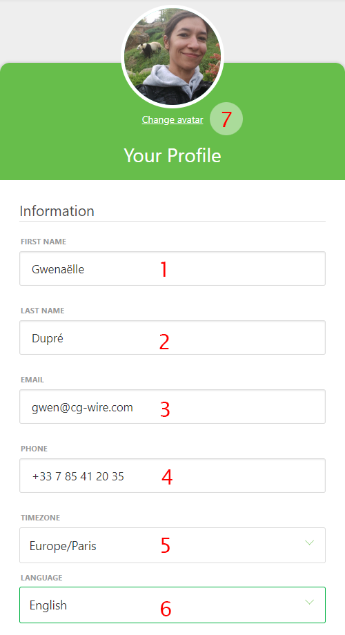
 
You can also define what kind of notification you want, email or slack.

 
If you keep scrolling you can also change your password if you want. We
encourage you to change the default password with one of your own.

 
 
## See your assignments
 
The central part for you, on **Kitsu**, is the **My tasks** page. 
It's the first landing page when you log in.

You can see per **Production** (1) the **Entity** (2) you are assigned to, but also the **Estimation** time (3), and the **Duration** (4) you already spend, the **Due date** (5), the
**Status** (6) of the tasks you are working on and their **priority** (7). 
 

You can sort your page per **name**, **priority**, **status**, **estimation** or **last comment**.

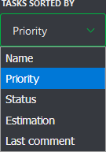

You can also filter your tasks.

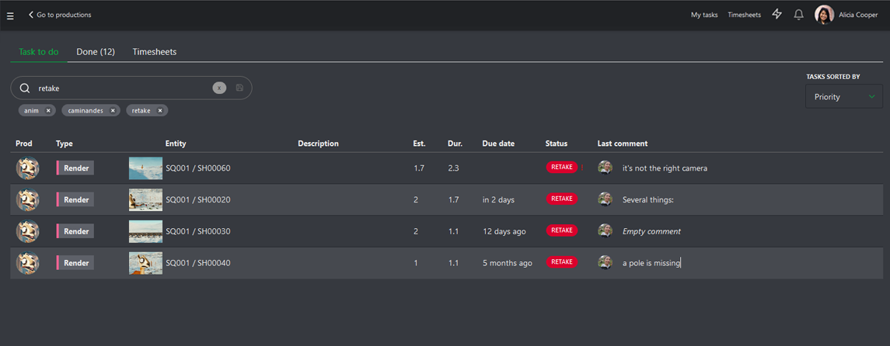

You can also find it on the main menu ,
under the **User** section of **MY TASKS**. The Kistu logo is a shortcut too,
to your task list.

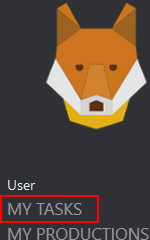

 
## Share your progress

When you start a new task you are assigned to, click on the status 
(1) on your my task page. You can also do it on the shots or assets page.

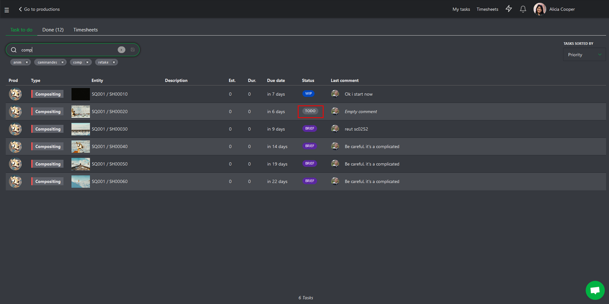

It opens a panel on the right of the screen, where you can communicate about your work. Let your teammates know what you are doing. 
For instance, show them you start working on something. 
Each time you change the status of a task, you can attach a
text comment to it.

For example, when you start a **new task** you can say that everything is ok.
If some information is missing, you can either ask all the questions you want.

To change the status, let's say from  to  as an example, start
by filling the comment box (1). Then, click on the status box and choose the
one you want (2), upload a preview (3) and validate your comment and the new status by clicking on
**Post status** (4) button.

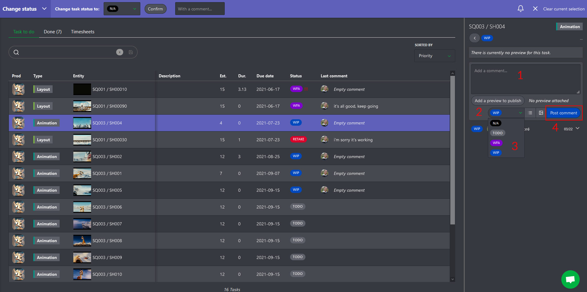

You can edit your last comment by clicking on the "history" button and then 
using the **edit** button 
.

## Ask for a review

You can ask for a review by switching the status of a task to 
(**Waiting for Approval** ). 
The first step is to change the status of your
task. 

You can drag and drop your file directly or, click on the **Attach preview** button.

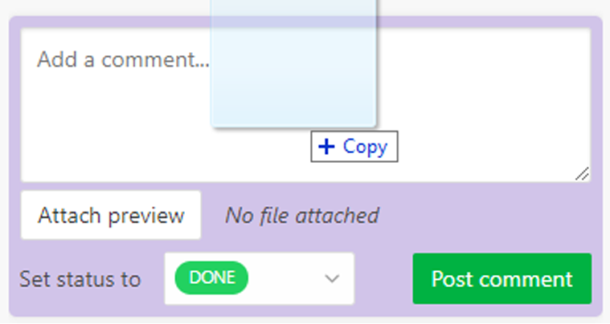

Moreover, then use the **Post comment** button.

Your work appears on the right part of the screen as a V1. 

If you post several revisions, you always keep track of your previous work.
Each time you add a new revision, the previous versions are still available. 

You can add multiple images at the same time, or, once you have uploaded an image, you can add another one.

The **Add preview** popup opens, and ask you to choose a file.

You can navigate through the pictures uploaded.

This detailed page of the tasks is your way to communicate with others.
They also use this page to answer your questions, give you feedback, and ask for a retake. The history of the conversation is always available.

For quicker access to the information, when you get back to your todo
page, the last comment posted on each task is available too.

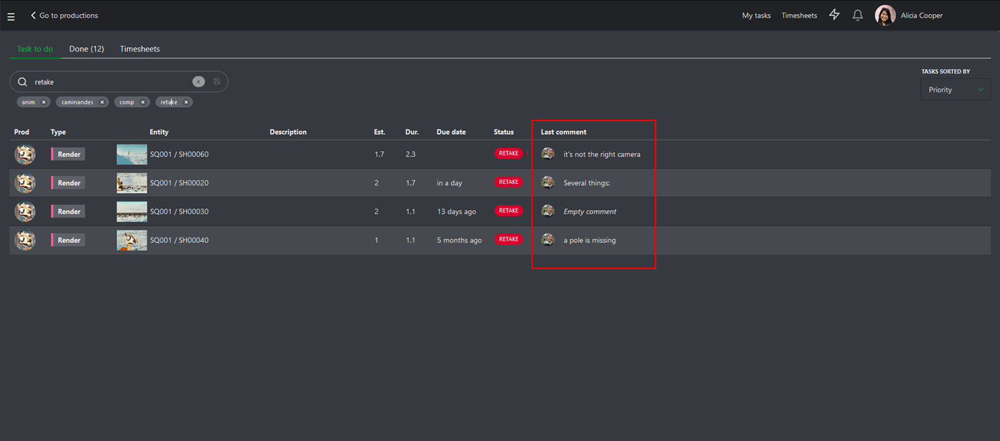

You can also see the tasks validated as  and the discard tasks as 
on the **Done** tab.

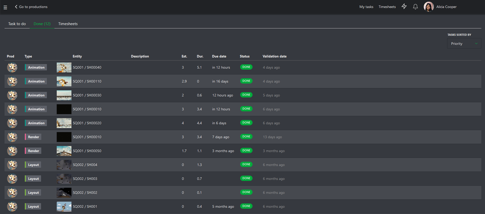

## Fill your timesheet

Every day, you can declare how much time you spent on each task. On your **My
Tasks** page, go to the **Timesheets** tab.

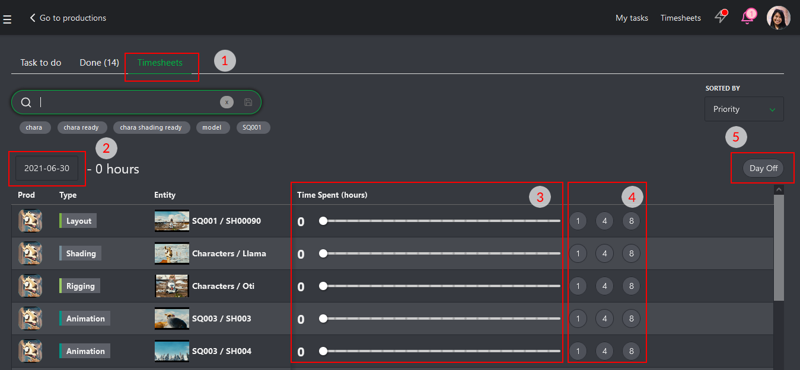

You need to move the cursor (1) next to each task accordingly to the number of
hours spent. You can also go quicker and click on the **1**, **4**, or **8**
hours buttons (2).

If one day you miss your declaration, you can click on the today date (3), and
go back in time and select the day you have missed.

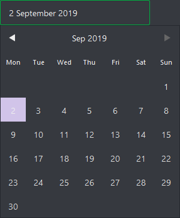

In case you forget to mention the time spent on a finished task, you can still 
find it in the **Done tasks** list located below the running tasks list.

