# Getting started as a Production Manager

## Create your first production

The first step on Kitsu is to create a production. Click on the **Create a new
production** button.  

Enter the name of your production, choose **TV Show** if you need more than one episode.
Then validate by clicking on **Confirm**.

To navigate through Kitsu sections, you need to use the sidebar. you can 
access it through the three lines button on top of the screen 
.  It opens a menu on
the left part of the screen. We want to see the production list. 
So in below **Studio** section, click on the **PRODUCTIONS** button. 

There, you can see all the productions you have created, their type and their status (open
for an Active Production, or Closed if not Active). When your cursor is above a
production line you can see two news icons on the right part of the line :
**edit**  and **delete**
.

To modify a production go into the **Edit production** page. 

You can add some specific information as the **FPS** (Frames per second), 
the **Ratio** and the **Resolution** of the picture.

NB: The default avatar for a production is the first letter displayed on a
colored background. You can change it with a picture if you want.

## Create some assets

So, now you have the first script for your production. It's time to do the
breakdown and the creation of the assets. It allows you to list your assets, 
dispatch the work to the CG artists, and follow the progress of each related
tasks.

Let's begin with the asset page. You can access it via the drop-down menu on top of the page. 

.

On the asset page, click on **Add assets**.

A pop-up window opens:
 
It asks you to choose the asset **Type** (1): Camera, Characters, Environment,
FX, Props, ...  
Let's start with an environment. You select the **Episode** (2), or the main pack (**All**).
We give it a **Name** (3) and enter a description that helps the designer to know what to do, and later to
identify the asset easily.
If you have multiple assets to create, click on **Confirm and stay**. You
can change the asset type, and keep adding assets. 

You can see the newly created asset appearing on the background, every time you click on **Confirm and stay**. After you added your last asset, click
on **Confirm**, it saves the asset and closes the window. If you don't have
more assets to add, click on **Close**, it cancels the window.

For now, the assets are linked with the first episode, or with the Main Pack.

You can edit assets by going to the asset page, hovering the
asset you want to modify, and then click on the **edit** button 
 (1) on the right side of
the line.  

On the main asset page, to extend the description, click on the first words
(2), and a pop-up opens with the full description.

## Create tasks for the assets

And now we can create tasks for the assets (3), like **Concept**, **Modeling**,
**Texture**, **Setup**, and other if needed (see 
[How to customize the workflow](.../faq/#how-to-customize-the-workflow)
).

Click on the **+ Add tasks** (3) on top of the spreadsheet. A new window will
open and on the list under **Type** you can choose the task you need to add,
validate it by **Confirm** button.

You added tasks to all the assets.

If you want to delete a task, If some assets don't match the task (as environment and setup), click on the menu to change the action (1), 
then select the **delete tasks** (2) on the left top
of the page.
 

Now that we have created all the assets and related tasks, we can now add the
artists to the team and assign tasks to them.

## Add a CG Artist to the team

Each artist required an account. Go to the drop-down menu , and under the **Studio**
section, choose **PEOPLE** page.

Then, click on the **+ Add a new employee** button. 

A creation window opens. You can enter the first (1) and last name (2), the email
(which is **mandatory** to create the account) (3), the phone number (4) and
define the role of the employee: **CG artist**, **Supervisor**,
**Administrator** or **Client** (5).  If the artist is working right now, keep
him as active, otherwise select no. Validate by clicking **Confirm** button.

See the [permissions](../permissions/README.md) section for more information. 
To make it short, CG artists, supervisors and clients only see the
productions they are assigned.

All the people are now part of your studio. They are added to a specific
production when you assign them to a task on a production. Otherwise, they
won't have access to anything.

You can also add someone to a production without assigning him a task.

On the drop-down menu on the top of the page, select the **TEAM** page.

 

On the **Team** page, you can see all the assignations for a specific project.
If you want to check another project team, you need to switch the project
on the top of the page.

You can also add someone to a production without assigning him to a task, you
can select his name on the search box (or type his name), and validate with
**add**.

## Assign tasks to a CG artist

We can now get back to the **ASSETS** page via the drop-down menu.

.

Now its time to do your first assignment! 

Click on the status (1) you want to assign.

The **Action Menu** on top of the screen appears. 

You can now do the assignation. Click on the text input, and you see
the list of available people. Click on a person's name to perform to select
him. Then click on the confirmation button to complete the assignation.

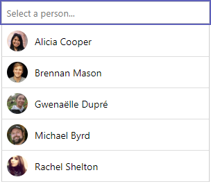

You can assign several tasks to the same person in one step (1). Once you have
the blue menu visible, keep **ctrl** on your keyboard pressed and select
multiple tasks. You can even use the **shift** key to choose a range of tasks
(2). When you have chosen everything you need, apply with the **Confirm**
button.  

In the same way, you can click on **Clear assignations** to remove all 
assignations.

When you finish all the assignations, quit this mode using the **Clear
current selection** button .

Now you can see next to each status the avatar of the CG artist.

To unclutter the list, you can hide this information with the **Hide
assignations** button on the top of the spreadsheet .

Once you assigned someone, he is part of the production team. Depending
on his position (CG Artist, Supervisor), he only sees the production where
he's assigned. 

Now, everybody knows what to do and who is doing what!

## Add an estimation for a task

Click on the name of a task type.

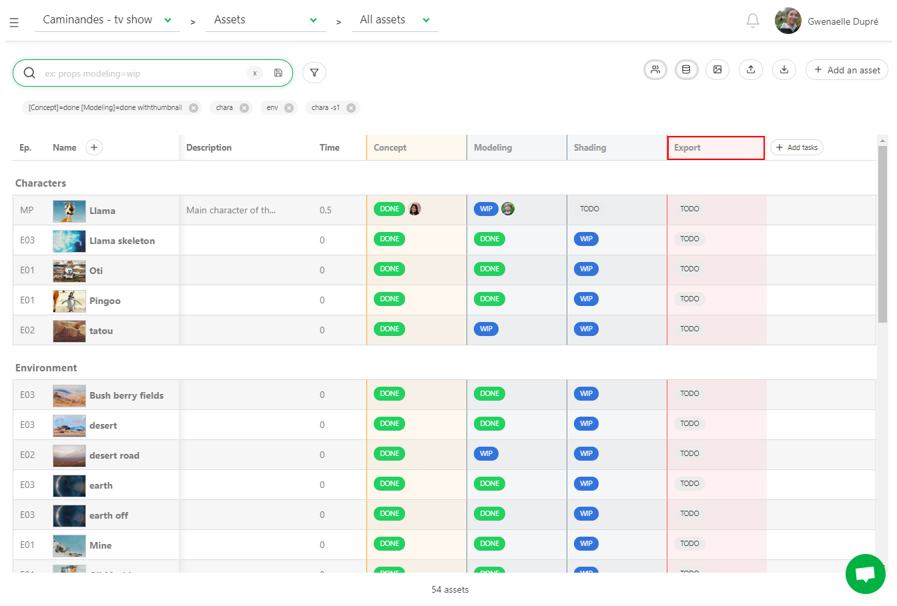

The new page is the **Supervisor view**. You have more detailed information specific to this task type.

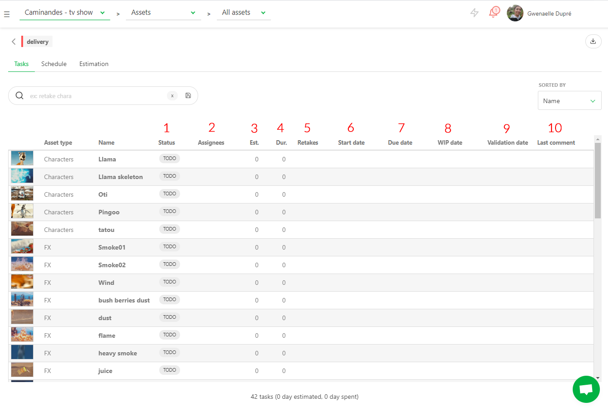

To add an estimation to a task, click on the line, and choose **Set estimations** on the **Action Menu**.

You can now enter the number of days you estimate. As for any action with the **Action Menu**, you can select
multiple assets or shots at the same time.
 

 
 
To go further in detail with the Supervisor view :  
- (1) You can see and change the status of a task
- (2) You can assign people to tasks
- (3) You can add an estimation for the task (in day unit)

(1) to (3) is filled with the action menu.

- (4) Kitsu calculate the sum of the timesheet fed by the artists
- (5) The number of back and forth with the retake status
- (6) The Due date is linked to the task type schedule
- (7)(8) the wip and validation dates are automatically filled
- (9) the Last comment section help you to keep an eye on the last activity of this task type.

(4) to (9) is automatically filled.
 

## Create sequences and shots

It's time to do the breakdown of the storyboard. Meaning you can create
the sequences and the shots of the episode and associate assets to them.

You need to go to the **Shots** page: you can use the
drop-down menu and click on the **SHOTS**.

 

To start with the shot creation, click on the **Add shots** button.

A new pop up opens, as for the creation of the assets.
You can now create the episodes, the sequences, and shots.

Enter the first episode using your code name, for example, e01, then click
on the **add** button (1).  Do the same for the sequence, for instance, sq01,
then **add** (2), and now the shots: sh001, then again **add** (3).
You can also define padding for your shots.

You can now see that new shots are listed, described by their episode and
sequence.
You have created the first shot of the first sequence of the first episode.

Now let's add more shots than just one! As you can see the box already contains your name
code but incremented, so you have to continue to click on **add** to
create more shots.

You have to do the same with the sequences and episodes.

If a shot is misplaced on a sequence, you have to edit the shot you want
, and change the
sequence. 

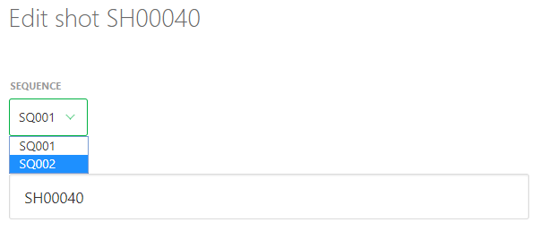

If at some point you need to delete a shot, click on the **trash can**
icon on the right of the line . 
If you need to import back this shot, click on the restore button 
.

We can now associate tasks with the shots. Same way than for the assets, click on
the **+Add tasks** button 
on the top of the spreadsheet. 

A new pop-up opens and lets you choose what task you want to add. All the
shots are linked to the tasks.

Now we can do the breakdown of the storyboard, meaning associate the assets to
each shot. 

## Create a breakdown list

You can fill the asset breakdown page, the same way than the shots. Select one or more assets on the left part, then add the elements from the right part.

## Add the Frameranges

At this stage of the production, the animatic should be done. Meaning you have
the length (**frame range In** and **frame range Out**) for each shot. You can
add this information to the spreadsheet.  This way, you are sure that all
the frames a calculated, and none are missing, or over computed.

You may also be able to add a camera as an asset!

You need to edit the shots to fill the frame range information. Click on the
edit button  on the right
side of the shot line.

On the new window, you can enter the **In** and **Out** of the shot. Save with the **Confirm** button. 

Now the frame range appears on the general spreadsheet of the shot page.

## Add Custom columns

To add more information on the general spreadsheet pages, you have to create a 
**Custom column**.

Click on the **+** near the Description column.

You may have extra information to add on your pages as the **level of difficulties**,
the **name of the studios**, when a production is split, etc.

In the custom column, you can store all kinds of information: a **list of value** or a **free value**.

The **free value** is different for each entity.

The **list of value** gives you the same choice for each entity. Moreover, it has to be filled now. 

Type the elements of the list below **Available values**, and confirm them by clicking on **Add value**.

Validate the creation of the custom column with the **Confirm** button.

Back on the global spreadsheets page, you can fill this information with the edit 
button .

You now see a new line on the edit pop-up. You can select the information from the list, 
alternatively, enter the free values, depending on your previous choice.

Don't forget to press the **Confirm** button when you are done.

If you need to **edit** or **delete** the custom column, go back to the general spreadsheet page.
Nearby the name of your custom column, click on the arrow . 

Select in the menu if you want to 
edit the name of the custom column and its information, or you want to remove it.

## Comment and validation

To write a comment and to change the status of a task, you can click on the
status of the task (1). 

It makes appear a panel on the right, and here you can write a comment (1) and change the status (2), attach a file (3).

Validate the post and the new status with **Post status**

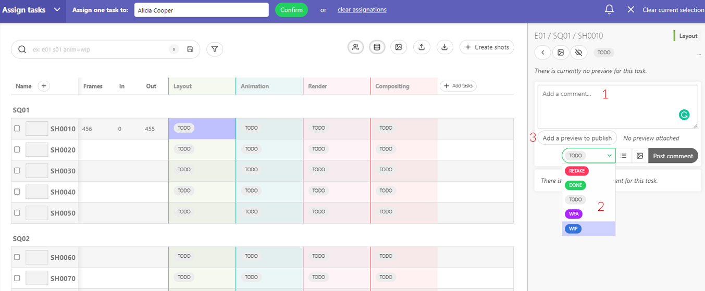

## Add preview

You can add a preview to any comments. It can be a picture (`.png`, `.jpg`, `.jpeg`), or a video (`.mp4`, `.mov`, `.wmv`), 
or an `.obj` file. All can be reviewed from the browser.

Other files like `.pdf`, `.zip`, `.rar`, `.ma` or `.mb` however, they need to be
downloaded to be reviewed.

If you have defined a **FPS** for the production, Kitsu will conform to the uploaded video to this FPS.

Otherwise, the video will be compressed to 1080P, and 30mbits/sec. 

Click on the "Attach preview" button, the explorer opens and lets you choose your file.

Once your file is selected, you see its name near the "Attach preview" button.

You can also **drag & drop** the file in the comment section.

Once you have uploaded an image, you can add another one.

The **Add preview** pop-up opens and asks you to choose a file.

You can navigate through the pictures uploaded.

## Validation per batch

Alternatively, you can do it per **batch**. 

You can select multiple shots or assets, by pressing the **crtl** or
**shift** key.

Then go to the **Change status** section on the action menu.

. You can also add a comment for all the selected tasks (2)
You validate the new status with the **Confirm** button.

## Change priorities

At some point on the production you may want to prioritize some tasks, and
pinpoint these urgent tasks to your team.

For this, we use the same technique as before. Click on the space
near a status task (1). 

The action menu appears on the top of the screen. 

Click on the name on the left on the action menu, and choose 
**Change priority**.

There are four levels of priority: **Normal**, that is the fundamental level of all the
tasks, **High**, **Very High**, or **Emergency**. Save the changes with the
**Confirm** button.

As we have done for the assignation or the status, select the shots (1), select
the level of priority (2), and apply with **Confirm** (3).

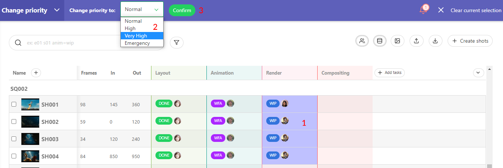

You can now see next to the status of the task some **exclamation marks**. The
more there are, the more urgent the task is.  

* (1) is **Normal**, 
* (2) is **High**,
* (3) is **Very High**
* (4) is for **Emergency**.
    

## Perform a review

When a CG artist needs a review, he changes the status of his task to .

Click on the status (1) to open the right panel and start the review. 

You can watch the version from the right panel, or enlarge it (2), or even go fullscreen    (3).

You can compare two task type or version side by side when you click on the **Compare** button 
.

You can draw directly on the preview with the **pencil** tool .

If you need to delete your line, click again on the **pencil** icon, the cursor changes to a multi-directional cross , and then you can select your line and move it around.

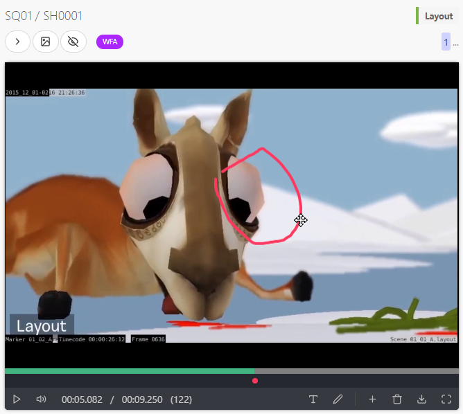

Select the line with the directional cross, and then press the **delete** icon 

From there, you can change the status to  if you want that the CG artist
performs some changes. 

You can add a **checklist** to your comments.

You need first to post your retake comments. Then the **ADD CHECKLIST** appears.

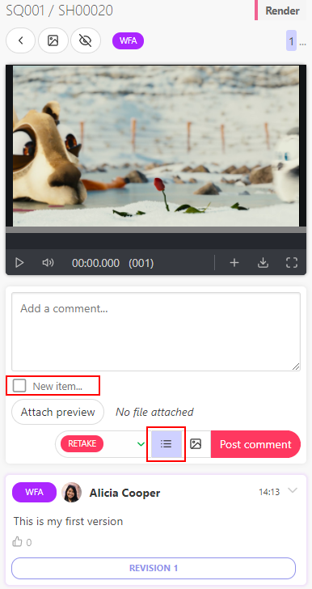

Type your comments, and hit **Enter** key to add another line on your checklist.

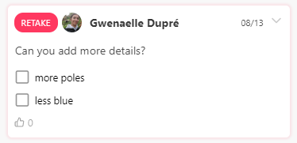

You can also **tag** someone of the team in the comments. Type the `@`and it opens a sub-menu with the list of the team. 

Alternatively, you can change it to , to notify the CG artist
that his work is validated.

## Add a thumbnail

You can use the preview as a **thumbnail** on the asset or shot spreadsheet. It
helps to recognize the assets/shots on the main pages. 
On the list page, click on the status you want, then on the right panel, click on **Preview** button (1).

Once you have clicked on the button, you see the thumbnail appears, and the button turns gray.

## Simplify the global page

You may need to reduce a task type column in a global page. For example, you may be 
only interested in layout and animation but not so much about the shipment for the client.

Close to each task type name, you can click on the arrow 
 to unfold a submenu. 

You can choose to **Minimize** or **Delete** the task type.

Once the column is minimized, only colored dots show the status.

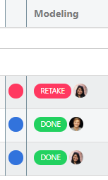

You can also hide all the non-essential column, like **Description**, **Custom column**, 
even the minimize columns.

Just click on the **Hide additional information** 
 button on the top right of the page.

To make the information reappear, click on the same button,
 it won't have the grey highlight.

## The timesheets

As production you can use the main menu to check the timesheets.

Open the main menu with the  button. 

On the menu, choose the **Timesheets** page.

You can choose which **month** or **year** you want to display.

You can also choose the level of detail: **day**, **week**, **month**.

Per week, Kitsu highlights the overdue time per CG Artist.

If you click on a number, a side panel opens with the details of the time spent per task this week.

You can also set up a number of working hours per day. 

Go back to the main menu, and select **Settings**. 

## Production Schedule

As production you can set the global schedule for your production. 

On the drop-down menu choose **SCHEDULE**

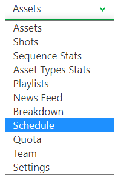

On top of the schedule, you can define the start date (1), and the end date (2). 
Click on the box to open the calendar and pick a date.
You can add your global man-days as on your quote.

You can define, on the Gantt Schedule, the start and end date of each task type. 
The task types are the ones you have already added to your production.

Put your cursor on the start date, and the cursor will change as a double arrow. Then drag and slide the start date.
Do the same for the end date. 

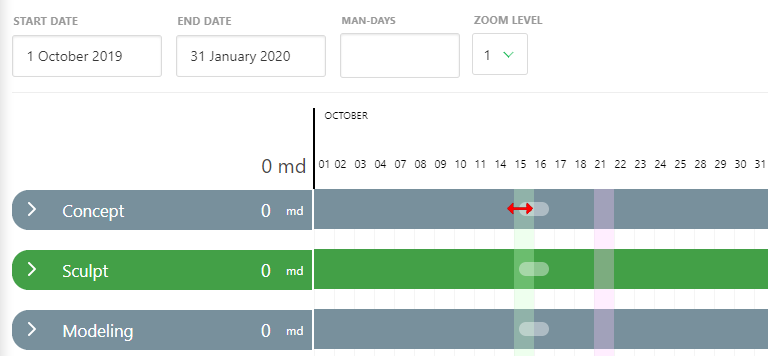

Once you have defined all the start and end dates of the task types, your schedule should look like the example.

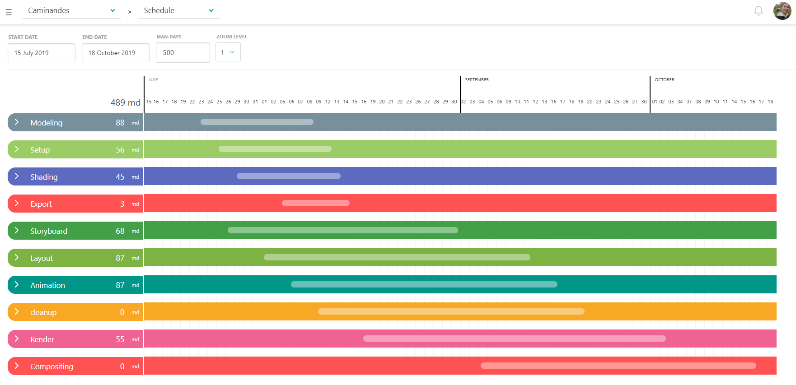

Once it's done, you can unfold each task type and access to a level of detail: asset type for the assets, 
sequences for the shots.

You can set the start and end date the same way than for the task type. You can define the work period for all the asset types.

You can do the same for the shots task types. You can determine the start and end date for the sequences.

You can add a milestone by hovering a date. A  appears, 

When you click, a pop-up window appears and asks you to add a name to the milestone.

You can see a small black dot and a vertical line as a display of the milestone.
If you hoover the little black dot, the name of the milestone appears.

You can change the name of the milestone if you click on the , or anywhere on the milestone name.

From there on can rename the milestone or delete it.

## Task Type Schedule

If you need more details than in the production schedule, you can go to the **Task Type** page.

You can notice there are two tabs on the page, Tasks and **Schedule**. Click on the  

On this page, you will be able to do the schedule per CG Artist and per asset (or shot, depending on the task type).

Put your cursor on the start date, and the cursor will change as a double arrow. Then drag and slide the start date.
Do the same for the end date. 

You can use the search bar (1) as on the other pages: you can search **status** 
(no need to add the name of the task type as you already are on a specific task type page), 
per **asset type** (or sequence), per **asset name** (or shot name), and per **CG Artist name**.

You can also reduce or expand each CG Artist (2) section, to ease the reading of the schedule.

And you can change the color of the bar in the Gantt diagram (3). Per default, the **coloring** is set in Neutral.

But you can the color of the bar, depending on what you need.

**Status color** will change the color of the bar based on their status. For example Blue is for WIP, red is for RETAKE, 
purple for Waiting For Approval, green is for Done.

In a glimpse, you can see the state of your elements and team.

**Late in red** display the bar that is not validated yet, but they are behind schedule.

The Gantt diagram has an impact on the other pages on Kistu.

The **due date** will be displayed on the **Tasks** tab of the task type page.

But you can also see the **Due date** on the **Todo Page** of a CG Artist.

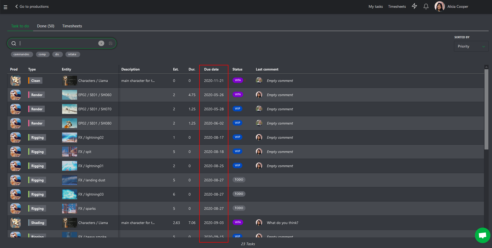
