# FAQ for Kitsu

* [How to share a preview?](#how-to-share-a-preview)

* [How to change your password?](#how-to-change-your-password)

* [How to have a global view of the production?](#how-to-have-a-global-view-of-the-production)
	* [Task global page](#task-global-page)
	* [Sequence global page](#sequence-global-page)	

* [How to create filters?](#how-to-create-filters)
	* [Introduction to filters](#introduction-to-filters)
	* [How to use the search bar?](#how-to-use-the-search-bar)
	* [How to save filter queries?](#how-to-save-filter-queries)
	* [What filters can I create?](#what-filters-can-i-create)
	* [How to delete filters?](#how-to-delete-filters)

 * [Where I can see my notifications?](#where-can-i-see-my-notifications)
	* [How notifications work?](#how-notifications-work)
	* [How to get notified?](#how-to-get-notified)
	* [How to not be notified anymore](#how-to-not-be-notified-anymore)

* [How to build a playlist?](#how-to-build-a-playlist)
	* [How to create a playlist?](#how-to-create-a-playlist)
	* [How to switch between tasks and revisions?](#how-to-switch-between-tasks-and-revisions)
	* [How to delete a playlist?](#how-to-delete-a-playlist)

-----------------------------------------	

## [How to share a preview?](#how-to-share-a-preview)

You can ask for a review by switching the status of a task to 
(**Waiting for Approval** ). This status allows you to share your progress by
posting a preview of your work. The first step is to change the status of your
task and post a comment. 

Then click on the **Add preview** button on your new post 
. 

A new window is displayed.

You can either drag and drop you pic or video on the **Choose a file** button,
or navigate through your system and pick your file, validate with the
**Confirm** button.

Your work will appear on the right part of the screen as a V1. 

If you post more revisions, you will always keep track of your previous work.
Each time you add a new revision, the previous versions are still available. 

 -----------------------------------------	

## [How to change your password?](#how-to-change-your-password)

Click on your name on the top right of the screen (1) then on **Profile** (2).

NB: A link to this documentation is available in this menu too (3).
 

If you keep scrolling you can also change your password if you want. We
encourage you to change the default password with one of your own.

 -----------------------------------------	

## [How to have a global view of the production?](#how-to-have-a-global-view-of-the-production)

### [Task global page](#task-global-page)

One way to have a global view is by clicking on the task name.

It will open a new page, where you can see the stage of all the assets status on this specific task.

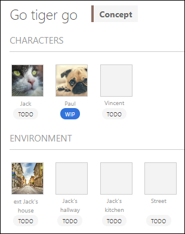

### [Sequence global page](#sequence-global-page)	

The other way is to go to the **Sequences** page. You can go there with the **sequence** 
button  on top of a page.

Or you can access it using the main menu , and then 
click on the **SEQUENCES** page under the **Production** section.

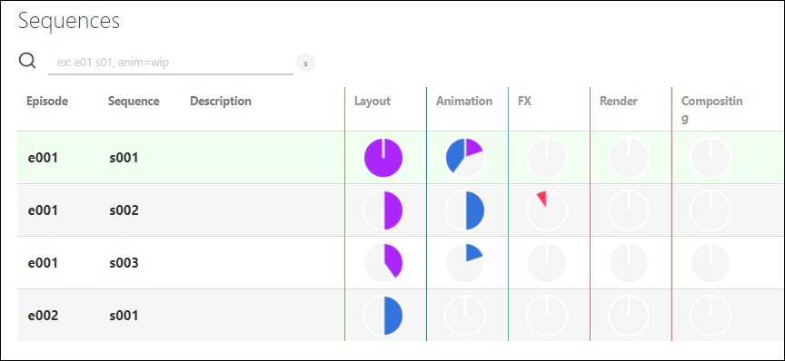

With this view you can see all the status distribution per tasks on each sequences.

You can fly over the pie chart to have more detailed information about the distribution.

You can also click on the **tasks name** to have the detailed shots about this task.

 -----------------------------------------	
 
## [How to create Filters?](#how-to-create-filters)

### [Introduction to filters](#introduction-to-filters)

In **Kitsu**, the filters are done through the **search bar**. It allows you to
**save** your search query. Once done you can run your query again with a
simple click.
 

You can find the **search bar** and the **save** option . in the following pages: 

* Assets
* Shots
* Sequences
* Todo-lists

NB: The **search bar** is available too in people episodes list.

### [How to use the search bar?](#how-to-use-the-search-bar)

The **search bar** query is applied everytime a new character is typed. You
don't need to type everything to get a prompt result.

For example, in the assets page, type the letter `V` and you wil get the
result of all the assets starting with a `V`.  

You can also search some specific **type of asset** : `Props`, `Character`,
`Environment`, `Fx` ... The result will display all the assets from this type.

For example, lets search all the **FX** assets. 
	
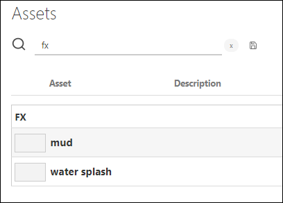

Another example get **shots page** of a specific **sequence**.
Ex: see only the shots of the first sequence of the first episode.

If you type `s001` the result will get all the shots of all the episodes
from sequence 1.

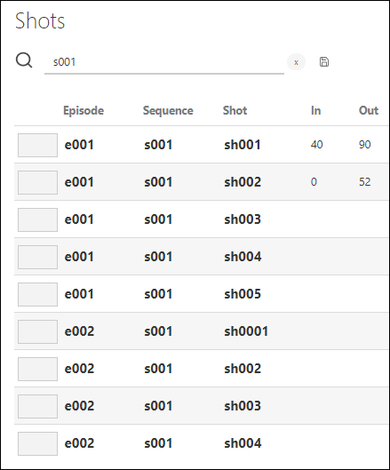

To be more specific you have to add information to your search. Let's type
`e001 s001`.

Then you get all shots for sequence 1 of episode 1.

In the same way, you can search **specific status** link to task. Type the
**name of the task** (or the **first letters**), then add the sign **equal**
(`=`) and the status you are looking for.

For example, search all the shots which are **Waiting for approval** 
at the **layout** stage. So on the search bar you will type : `layout=wfa` or
`lay=wfa`.

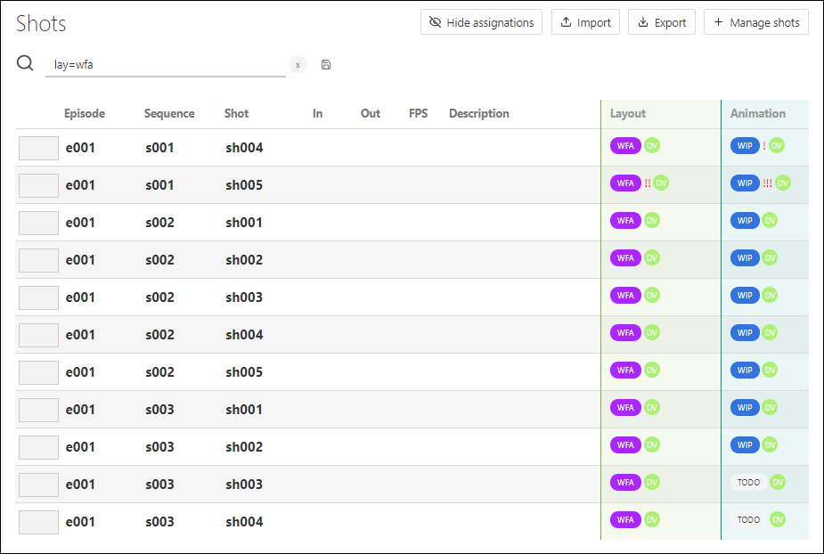

You can be even more specific, lets focus on the first episode : on the search
bar add a **space** after the previous search and type `e001`. You can be even
more precise and ask to see only the sequence 2. The research will be `lay=wfa
e001 s002` or `s002 e001 layout=wfa`.

### [How to save filter queries?](#how-to-save-filter-queries)

Kitsu allows you to save your research. You can save them by pressing tne
**Enter**, or click on the **Save** button 
.

Now under the **search bar** you can see your saved queries as buttons. 

Everytime you get back to this page, the buttons will be there. It will help
you to run commont queries faster.

### [What filters can I create?](#what-filters-can-i-create)

You can create **filters** about **entities** :

* **Episodes** : `e001`, `e002` etc.  
* **Sequences** : `e001 s001`, `s001 s001` etc.
* **Asset Type** : `characters`, `environment`, `fx` etc.

You can also create **filters** about **task status**: always use
**task=status**, you don't have to type all the letter of the task, Kitsu will
understand only the first. But the status has to be fully typed.

* Layout is Work in progress (wip) : `layout=wip` or `lay=wip`
* Concept is waiting for approval (wfa) only for the fx : `concept=wfa fx` or `fx con=wfa`
* On episode 2 Layout is wip : `e002 lay=wip` or `layout=wip e002`

### [How to delete filters?](#how-to-delete-filters)

If you have created a **filter button** by mistake, click on the cross next to
it .

The result of the filter will be display, but not the button anymore. Just
cancel your research by deleting the text or use the cross next to the search
bar 

-----------------------------------------

## [Where can I see my notifications?](#where-can-i-see-notifications)

### [How notifications work?](#how-notifications-work)

The notification symbol is the **Bell** button next to your name, top right of
the screen.  Its color is **grey** 
 when you don't have
any notification, and **green** 
 when you have a new
one.

When you click on the **bell** button, it will open the **notifications** page.

There, you can see all the changes made to the **tasks** you are following or
assigned to you.

There is a lot of informations on a notification : 

* (1) the name of the **author**
* (2) the related **entity**
* (3) the related **task**
* (4) the new **status**
* (5) the **attached file**

and (6) the comment.

Each part is a **link** you can use to jump on the information you need. If you
click on the **status**, you will jump to the status page of the entity. So you
can react quickly to this new change.

For example, let's assign Jacques to a new task and ask him to work on it.

Jacques receives immediately a notification, the **bell** button change color
 , and he can read the
new comment.

**All the notifications and comments appear in real time**. No need to refresh
to stay up to date.

### [How to get notified?](#how-to-get-notified)

As an artist you will receive a notification 
 as soon as someone change
the status of one of your task, or post a comment.

You can also choose to follow specifics tasks. Go into the task page you want
to follow: on the **assets** or **shots** pages click onto the status icon.

On the top right side of the page you can see an **eye** button 
, next to the
**delete task** button.

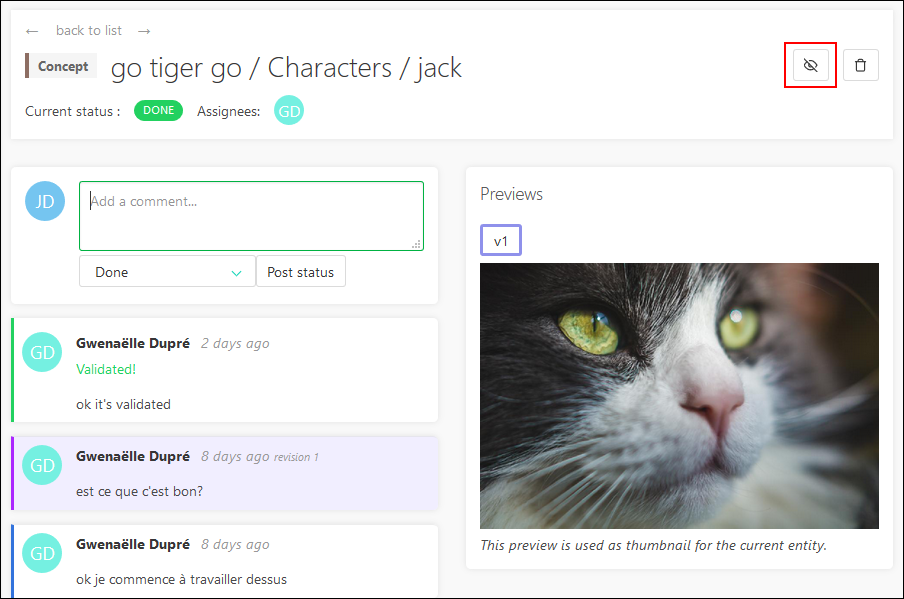

By default you are following all the tasks you are assigned to, on the task
page the icon will be **open** . 

If you want to follow another task, just click on the **crossed eye** button
, it will change, not
crossed anymore  meaning you
are now following this task, and will receive notification about it. 

### [How to not be notified anymore?](#how-to-not-be-notified-anymore)

If you don't want to follow a task anymore, just click on the **eye** button
 on the task page. It 
will be crossed , meaning
you won't receive notifications anymore.

------------------------------------

## [How to build a Playlist?](#how-to-build-a-playlist)

### [How to create a playlist?](#how-to-create-a-playlist)

You can find the **Playlists** page on the **main menu** 
 under the **Production** section. 

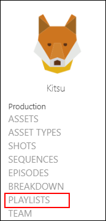

The **playlists** page is separated in 3 parts: 

* (1): The playlist list where you can **create** a playlist, or load an existing one.
* (2): The shots of the current playlist. 
* (3): The **shots** you want to show.

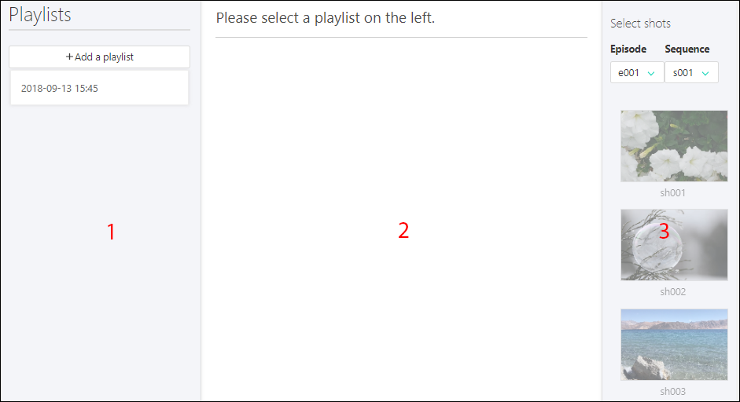

Start by creating a **Playlist** 
, You default name
will be the date and the hour. You can change it later via the
**edit** button . 

Once the playlist created, via the right pane, you can select wich shots to add
to your playlist.  Start by selecting the **episode** and the **sequence**.
The sequences shots are now listed. Click on the shots you want to add to the
playlist to see them playlisted.

The shots will appear on the middle part of the screen. Every changes are 
automatically saved.

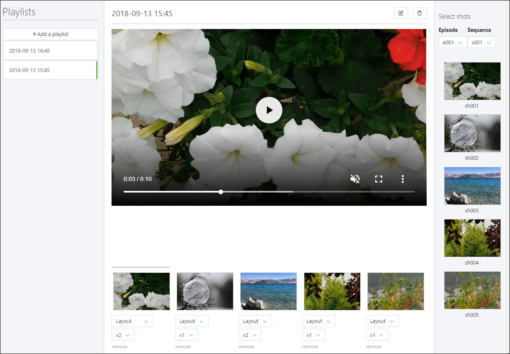

### [How to switch between tasks and revisions?](#how-to-switch-between-tasks-and-revisions)

For each playlisted shot you can choose the **task** and the
**version** you want to see.

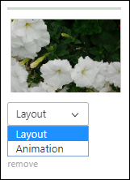
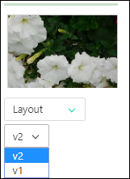

### [How to delete a playlist?](#how-to-delete-a-playlist)

To delete a playlist, load it by clicking on its name. Then,
click on the **delete** button . 
The button is located in the top right of the middle pane.

A confirmation pop-up will appear. Validate it by clicking the **Confirm**
button.

