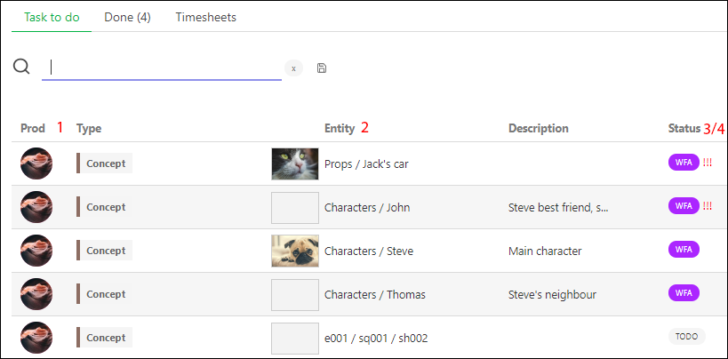
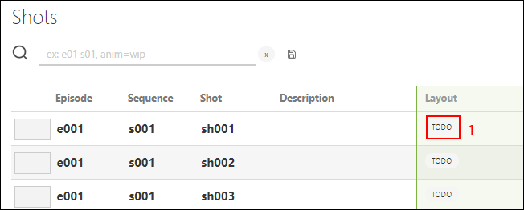
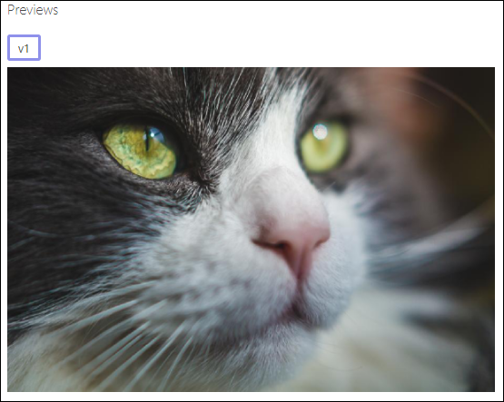
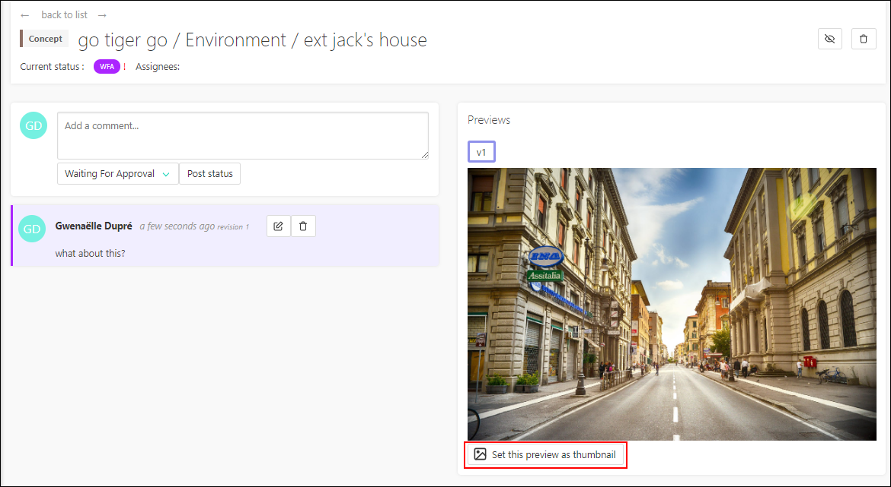
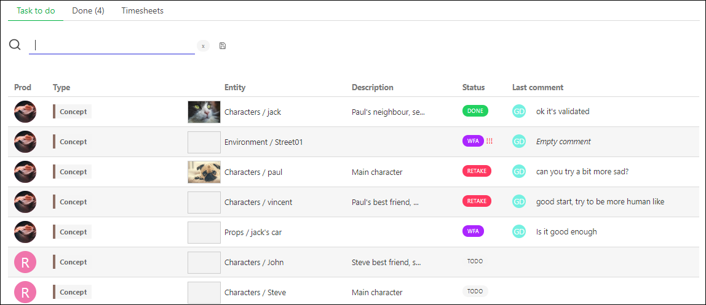

# How to get started with Kitsu

## [As an artist](#as-an-artist)
 
 When your account is created on Kitsu, you can fill in detail your profil.
 Click on your name on the top right of the screen (1) then on **Profile** (2).
 

 
On this new page you can check your name (1) (2), your email (3) fill you phone number (4), change the timezone (5) and the language of the website (6), and post of pic of yourself as your avatar (7). It will help to recognize who is doing what and you can also identify more easily your coworker! Kitsu can now be used as a who's who!
 

 
If you keep scrolling you can also change your password if you want.

 
 
### [See what you have to do](#see-what-you-have-to-do)
 
The main part for you, on **Kitsu**, will be the **My tasks** page. You can find it on the main menu , under the **User** section **My tasks**.

You can see per **Production** (1) the **Entity** (2) you are assigned to, the **Status** (3) of the tasks and the **Priority** (4). 
 

 
### [Communicate and change status](#communicate-and-change-status)

When you start a new task you are assigned to, click on the status (**TODO**) (1) on the shots or assets page.

It will open a new page where you can communicate about your work. Let your teammate know what you are doing and when you are starting! 
For each status change you need to add a comment.

For example when you start a **new task** you can say that **you have well understood everything and you are starting it**, or you can **ask all the question you have**, if you miss information for example.

To change the status, from **todo** to **wip** for example, fill your comment (1), click on the status box and choose the one you want (2) and validate your comment and the new status by clicking on **Post status** (3) .

If needed you can edit your last comment using the **Edit button** 

### [Ask for validation](#ask-for-validation)

You can ask for a validation (**Waiting for approval**) to share your progress by posting a preview of your work. Change the status of your task and post a comment. 

Then click on the **Add preview** button on your new post . 

A new window opens.

You can either drag and drop you pic or video on the **Choose a file** button, or navigate through your system and pick your file, validate with the **Confirm** button.

Your work will appear on the right part of the screen as a V1. 

If you need to post more versions, you will always keep track of your previous work, the older versions aren't hidden.

You can also use this pics as a thumbnail on the asset or shot spreadsheet. It will help to recognize the assets/shots on the main pages.
Below your preview, click on the **Set this preview as thumbnail**. You can do this at each version of your work if needed.

Once you have clicked on the button a message appears instead to confirm the modification.

This detail page of the task will be your way to communicate with other, they will also use this page to answer your question, or to give you feedback. At all time you can see all the historic of the communication.

When you will get back to your todo page, you will see all the last comment posted on each task you are assigned to. 

You can also see the tasks validated or N/A on the **Done** tab.

### [Fill the timesheet](#fill-the-timesheet)

Everyday you can declare what time you have spend on each task. Go to the **Timesheets** tab, and move the cursor next to each task accordingly to the number of hours spend. You can also go quicker and click on the **1**, **4**, or **8** hours buttons.

If one day you miss your declaration, you can click on the today date, and go back in time, same with the **Done** work!

 
	
