# How to get started with Kitsu

## As a production manager

### [Create a production](#create-a-production)

The first step on Kitsu is to create a production. Click on the **Create a new production** button.

Enter the name of your production, keep the status as **Open** if you want to work immediately on it.
Then validate by clicking on **Confirm**.

The main navigation will be with the 3 lines on the top of the screen .
It will open a menu on the left part of the screen. Choose below **Studio** section the **Productions** page. 

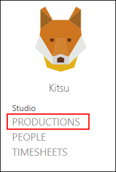

There, you can see all the productions you have created, and their status (open for an active production, or closed if not active). When you go on top of a production you can see 2 news icones on the right part of the line : **Edit** and **Delete** .

Go into the edit menu for you newly created production. You can change the picture of you production, instead of showing the first letter. 

### [Create some assets](#create-some-assets)

So now you should have the first script of your production. It's time to do the breakdown and the creation of the assets.
It will help you to find the assets you could reuse from past episode, and help to dispatch the work to the artists.

Lets begin with the asset page, you can access it by multiple ways, the fastest and easiest is with the asset icone on top of the page .

On the asset page click on **Add assets**.

A pop up window open :
 
You can choose the **Type** (1) : Camera, Characters, Environment, FX, Props.
Lets start with an environment. We will give it a name under **Asset** (2), and enter a description that will help the designer to know what to do, and later to indentify easily the asset.
If you have multiple assets to create, click on **Confirm and stay** (3), you can change whenever you want the asset type, and keep adding assets.
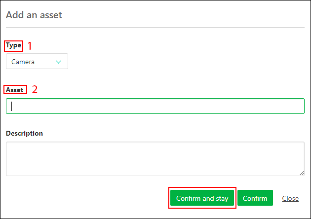

You will see the newly created asset appearing on the background everytime your click on **Confirm and stay**. When you have added you last asset, just click on **Confirm**, it will save the asset and close the window. If you don't have more asset to add, click on **Close** it will cancel the window.

For now the assets aren't associate to episode, this association will be done during the **Breakdown** of the storyboard, with sequences and shots creation.

You can edit assets any time you want by going to the asset page, hovering the asset you want to modify, and then click on the **Edit button** (1)  on the right side of the line.

On the main asset page, to read the full description, just click on the first words (2), and a pop up will open with the full description.

Then we can associate tasks to the assets (3), like **Concep**, **Modeling**, **Texture**, **Setup**, and other if needed.

You just have to click on the **Add tasks** (3) on top of the spreadsheet, a new window open, and on the list under **Type** you can choose the task you need to add, validate it by **Confirm** button.
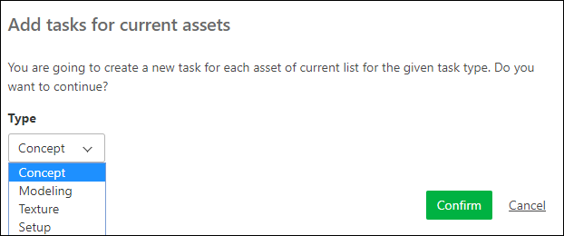

This tasks will be added to all the assets.

If some assets don't match the task (as environment and setup) just change the status of this task on **N/A**, or delete it.

So, to change a status : click directly on the status you want to change (1).

A new page is opened, and here you can add a comment to explain the change of status (1), and choose a new status for the task (2). Validate with **Post status** (3).

Now that we have created all the assets we need, and have linked them to tasks, we can now add the artists and assign them.

### [Add an artist](#add-an-artist)

We need to create a account for each artist.
Go to the main menu , and under the Studio section, choose **People** page.

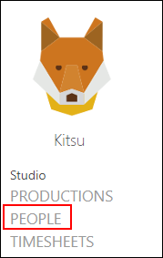

Then click on the **Add a new employee** button. . 
On the new window you can enter the first (1) and last name (2), the email (which is mandatory to create the account) (3), the phone number (4) and define the role of the employee : **CG artist**, **Supervisor**, **Administrator** or **Client** (5). 
If the artist is working right now keep him as active, otherwise select no.
Validate by clicking **Confirm** button.

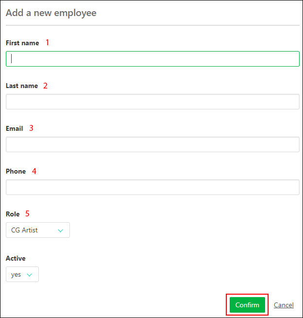

We can now get back to the **Assets** page. You can use the main menu  under the **Production** section.

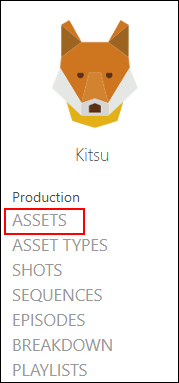

### [Assign an artist](#assign-an-artist)

Now is time to assigned the artist! 

On the assets page, click on the empty space on the right of a status of the asset you want to assign.

A new blue line on top of the screen appears. 

You can add the assignation. As soon as you click on the box you will see the list of the people. Just click on the name to assign him.

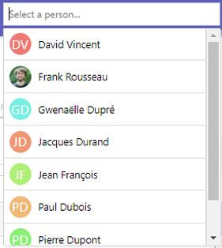

You can assign several task at the time to the same person (1). Once you have the blue menu visible, just keep **Ctrl** on your keyboard pressed and select multiple tasks. You can even use the **Shift** touch to select a range of tasks (2). When you have selected everything you need, apply with the **Confim** button.
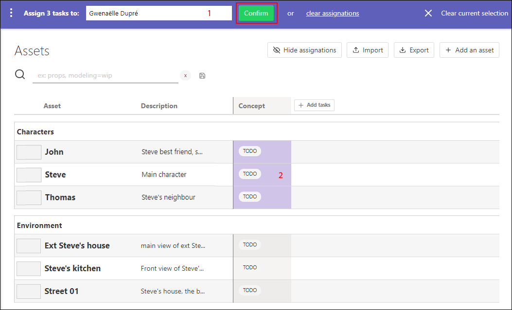

On the same way you can **Clear assignations** if needed.

When you're done with all the assignation quit this mode using the **Clear current selection** button .

From now you can see next to each statut the initial of the artist, or his pic if he has added one. 

If you want you can hide this information with the **Hide assignations** button on the top of the spreadsheet .

Now everybody know what to do, and who is doing what!

### [Create sequences and shots](#create-sequences-and-shots)

Now is the time when you have to do the breakdown of the storyboard. Meaning you can now create the sequences and the shots of the episode.

You need to go to the **Shots** page : you can either use the shot icone on top of the page , or use the main menu and under the **Production** section, click on the Shots.

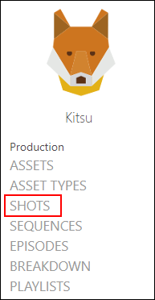

You want to click on the **Add shots** button. A new pop up will open, as for the creation of the assets.

You can create now the episodes, sequences and shots.

Enter the first episode using your own code name, for example type e01, then click on the **Add** button (1).
Do the same for the sequence, for example, sq01, then **Add** (2), and now the shots : sh001, then again **Add** (3).

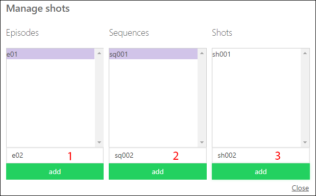

You can now see that the episode, sequence and shot are on a line, they are linked, you have created the first shot of the first sequence of the first episode. So everything is on track.

Now to add more shots: as you can see the box is already fill with your name code but incremented, so you just have to continue to click on **Add** to create more shots.

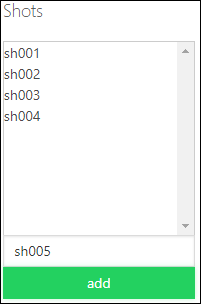

You just have to do the same with the sequence.

If you have miss a shot on a previous sequence, you just have to edit the shot you need , and change the sequence. 

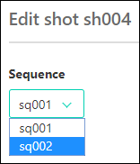

If at some point you need to delete a shot, just click on the delete icone on the right of the line . If you need to re import this shot, click on the restore button .

We can now associate tasks to the shots. Same way than for the assets, click on the **+Add tasks** button  on the top of the spreadsheet. 

A new pop-up will open and let you choose what task do you want to add to the shot. All the shots will be linked to these tasks.

Now we can do the breakdown of the storyboard, meaning associate the assets to each shots. 

### [Create a Breakdown list](#create-a-breakdown-list)

On the main menu , under **Production** section, choose breakdown.

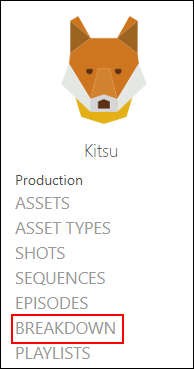

On the left part of the breakdown page there is the sequence menu (1), you can choose between the episode and the sequence you have created. And on the right part of the screen all the assets available that you have created for this production (3). And on the middle part it will be your selection for the shot (2).

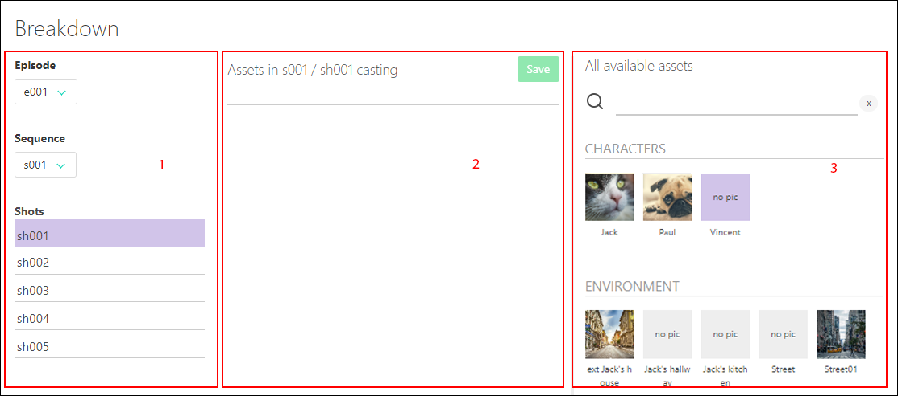

So now you have to select the shot you wan to cast, let's say the first one. So click on the shot sh001, then click on the assets you want to assign, some characters, backgrounds,etc. 
When you pass over the asset you can see a +1 or +10. It's the number of time you want to add this asset. 

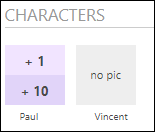

You can click the number of time you need the asset. You can now see the asset appearing on the middle part of the screen. Next to the name of the asset is the number of this asset you have add.

If you add twice an asset by mistake, you just have to go on the middle part of the screen, on your selection of assets for this shot, and selection -1.
When you are done for this shot click on the **Save** button, and go on with the other shots.

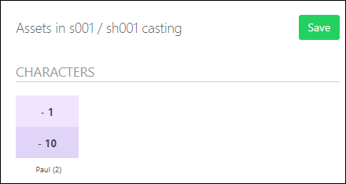

If a new asset is created during the storyboard just get back to the asset page (using the button on the top of the screen or via the main menu) 
, create the assets you need. The tasks previously created will be applied immediately to this new asset. You will have to do the assignation on it, and you're good to continue with the breakdown.

We can now assign people on the shots tasks. If the animation and so are done elsewhere, you can create a account for this studio and assign it tasks. They will be able to feed by themself the spreadsheet.

Everything is now filled, if you want to see a detail of a shot, click on his name, a new page will open with the list of the taks, the assignation, and the list of assets that will appear on this shot.
 
### [Add the Frameranges](#add-the-frameranges)

At this stage of the production the animatic should be done. Meaning you have the lengh (**framerange In** and **framerange Out**) for each shot. You can add this information on the spreadsheet.
This way you will be sure that all the frames will be calculated and none will be missing, or over compute.

You may also be able to add camera as assets!

You need to edit the shots to fill the framerange information. Click on the edit button on the right side of the shot line.

On the new window you can enter the **In** and **Out** of the shot, you can enter it by hand or use the **+** and **-** buttons.
Save with the **Confirm** button. Now the framerange appears on the general spreadsheet of the shot page.

### [Validation per batch](#validation-per-batch)

To do a validation (changing the status of a task) you can do it by click on the status of the task on the spreadsheet. It will open a new page, and here you can post a comment and change the status.

Or you can do it per batch. 
We will use the same technique as for the assignation.
Click on the empty space on the right of the status/assignation on a task.
The blue line on the top of the screen will appear. 

You can change it purpose by clicking on the 3 vertical dots on the left part of the screen and choose **Change status**.
You can now do you selection, with **Crtl** of **Chift** and choose the new status for your selected tasks. Validated the new status with the **Confirm** button.

### [Change the priority](#change-the-priority)

At some point on the production you may want to prioritized some tasks, and pinpoint these urgent tasks to your team.

For this we will use the same technique than for the assignation or the changing status. Click on the empty space near a task. The blue menu will appear on the top of the screen. click on the 3 dots menu button, and choose **Change priority**.

There is 4 levels of prioriy : **Normal**, that is the basic level of all the task, **High**, **Very High**, or **Emergency**. Save the changes with the **Confirm** button.

You can now see next to the status of the task some **Exclamation mark**. The more there is, the more urgent is the task.